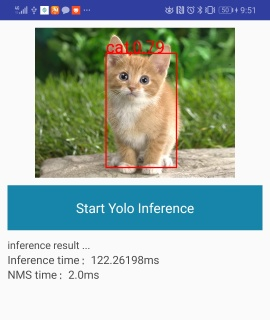

# Simple Android Demo based on official Android Demo
A prebuilt apk(armv8a) is [available](https://pan.baidu.com/s/1uYoqX3peVPKoxDcMP5Zv7Q)  提取码: 6rpc 
## Quick Start 
1. cd **assets** directory.
    ```
    mkdir yolov3
    ```   
2. Put model file(e.g. voc320_quant.mnn) and classname file(voc.txt) in yolov3.
3. Build and Run.

## Qualitative Result  
note: test on HUAWEI Mate20 using voc320_quant.mnn, numThread=2.  



## TODO
- [ ] Video Mode Support.
