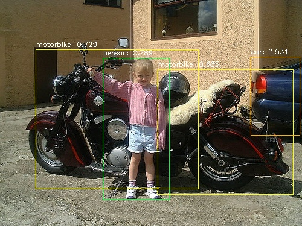

# MNN-yolov3

## Introduction
MNN demo of YOLOv3(converted from Stronger-Yolo). 

## Quick Start 
1. Install [MNN](https://github.com/alibaba/MNN) following the corresponding guide. 
2. Setup an environment following [Stronger-Yolo](https://github.com/Stinky-Tofu/Stronger-yolo).
3. run v3/pb.py to convert tensorflow checkpoint into portable model.
4. (optional) Fold constants using TF tools. (Recommended by MNN.)
    ``` bash
    bazel-bin/tensorflow/tools/graph_transforms/transform_graph --transforms=fold_constants(ignore_errors=true)
    ```
5. Converting model (remember to build convert tools first)
    ``` bash
    cd {MNN dir}/tools/converter/build/
    ./MNNConvert -f TF --modelFile {MNN-yolov3 project dir}/v3/port/yolov3_opti_fc.pb --MNNModel yolo_opti_fc.mnn --bizCode MNN
    ```
6. Copy MNN-demo/yolo.cpp in to {MNN dir}/demo/exec and  Modify {MNN dir}/demo/exec/CmakeLists.txt like MNN-demo/CmakeLists.txt.
7. Run cpp execution.
## Quantitative Analysis 
Note: Inference time is tested using MNN official Test Tool with scorethreshold 0.2 And **0.7849** is the original tensorflow result. All **map** results are evaluated using the first 300 testing images in order to save time.

Model|InputSize|Thread|Inference(ms)|MAP(VOC)|
| ------ | ------ | ------ | ------ | ------ |
Yolov3|544|4/6/8| 2962/2975/3043|0.7803(**0.7849**)|
Yolov3|320|4/6/8|828/668/821|0.7127(**0.7249**)|

## Qualitative Comparison
- Testing Result in Tensorflow(top) and MNN(down).   



## Important Notes during model converting 
1. Following [this issue](https://github.com/onnx/tensorflow-onnx/issues/77#issue-342137999) to remove/replace some op.
2. Remove condition op which is related to BatchNormalization and training Flag. Otherwise it will cause MNN converting failure.
    ```
    Identity's input node num. != 1
    ```
3. Replace v3/model/head/build_nework with build_nework_MNN, which replaces tf.shape with static inputshape and replace 
    ```
    [:, tf.newaxis] -> tf.expand_dims // currently strided_slice op is not very well supported in MNN.
    ```

## TODO
- [ ] Speed analyse.
- [ ] Model Quantization.
- [ ] Android Support.  

## Reference
[stronger-yolo](https://github.com/Stinky-Tofu/Stronger-yolo)

[MNN](https://github.com/alibaba/MNN)

[NCNN](https://github.com/Tencent/ncnn)
